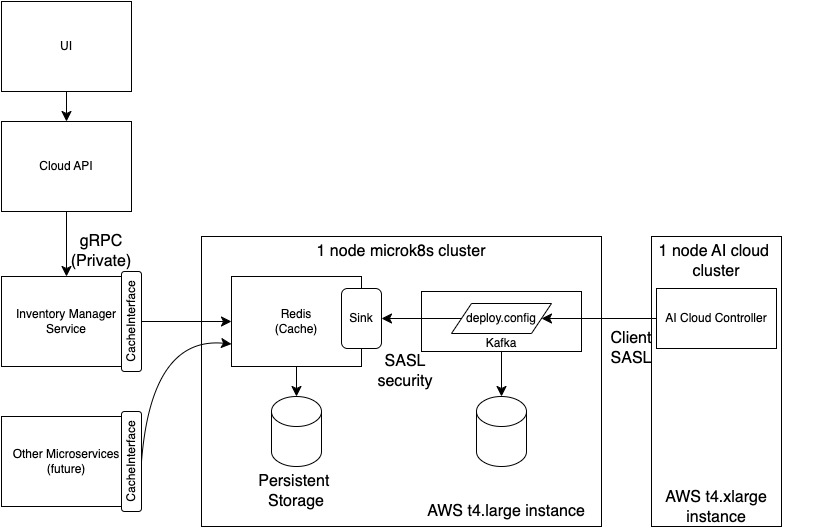

# inventory-manager
A gRPC service that returns sync'ed entities from kafka events.

## Quick Summary

The design leverages Redis as the cache manager and in a way is abstracts the inventory-manager from dealings with event driven framework provided by Kafka.
The syncronization between kafka and the cache will happen at its own interval and is not dependent on the API calls made by the inventory manager service. 



## Getting Started

Clone the repo and build
```
git clone https://github.com/aiorch/inventory-manager.git
cd inventory-manager

```

Setup the environment variables to configure Redis access

```
REDIS_IPADDR = 18.220.174.170
REDIS_PORT   = 32755
REDIS_SECRET = $(kubectl get secret --namespace redis redis -o jsonpath="{.data.redis-password}" | base64 -d)

Note: you will need to access the 1 node microk8s environment to extract the secret value.
```

Run the inventory-manager service

```
go run cmd/server/main.go
```


